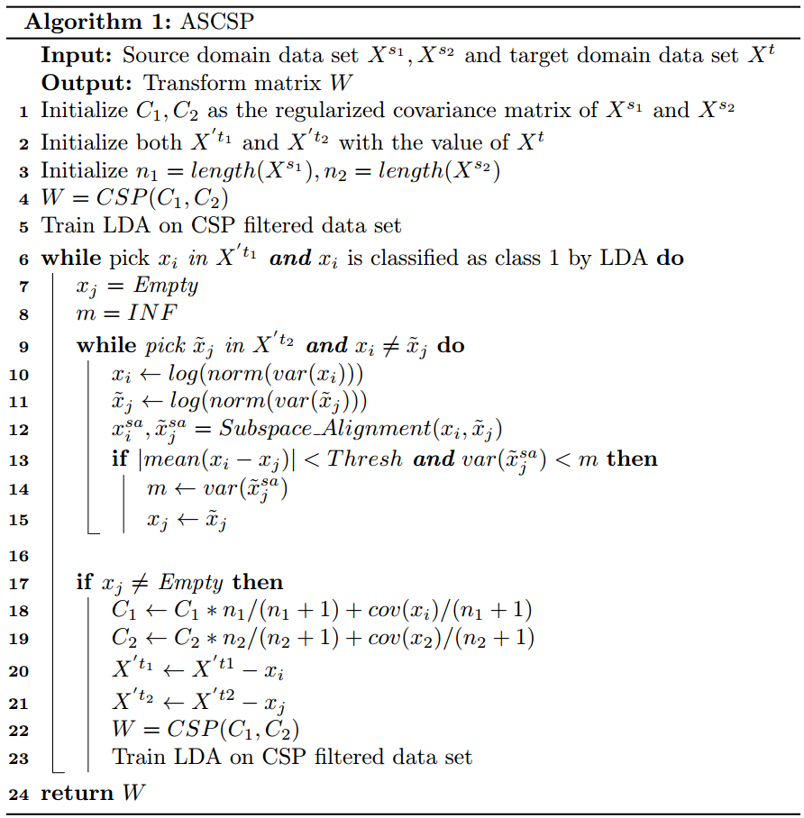
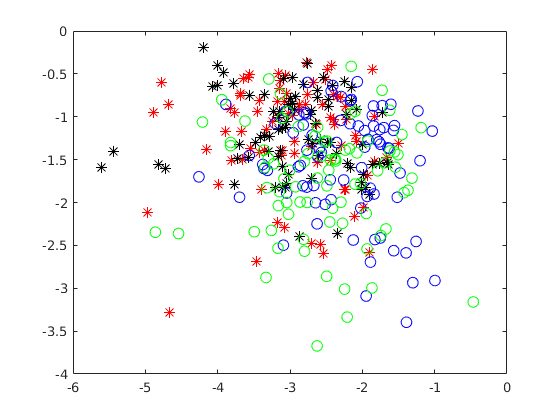
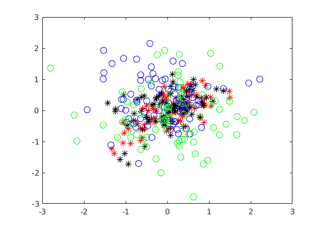
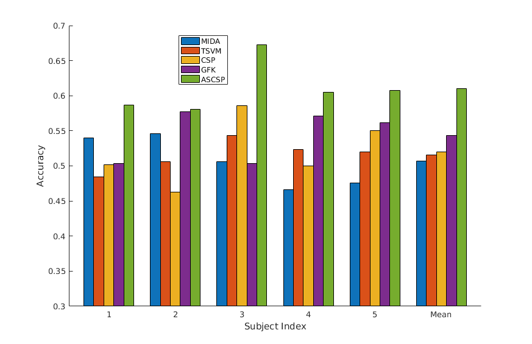

# Adaptive Selective CSP based Motor Imagery Classification for Subject to Subject Transfer

Summer research in De Sa's lab supervised by Prof. Virginia De Sa. EEG signals are used to interpret the inner brain activity.

## ASCSP

C1, C2 is initialized as mean covariance matrix in source subject.

Then repeatedly do the following two steps.

- Find two trials in target subjetc such that the difference of the mean is minimized and variance after subspace alignment is maximized.
- Update the covariance matrix with newly selected covariance matrix. C1 = C1\*n/(n+1)+Cnew1/(n+1) and C2 = C2\*n/(n+1) + Cnew2/(n+1)

After adapting C1, C2 with target trials, triditionals CSP is adpoted as spatial filter to reduce the number of electrodes from 47 int 6 which is 3 minimal eigen vactor and 3 maximal eigen vector. Log of variance is used to extract the feature in each dimension in each trial.

Because the subject difference, Subspace Alignment is adopted to reduce the source and target variance. After Subspace Alignment, the dimension is reduced to 2.

After domain adaptation, LDA is used to classify.

The algorithm is show as follows.

## Effect of Subspace Alignment

## Result
Following table and figure are the result of subject to subject transfer.

Method | Subj1 | Subj2 | SUbj3 | Subj4 | Subj5|Mean  |Std
-------|-------|-------|-------|-------|------|----  |---
MIDA   |0.5401 |0.5463 |0.5062 |0.4660 |0.4753|0.5068|0.0326
TSVM   |0.4846 |0.5062 |0.5432 |0.5231 |0.5201|0.5154|**0.0194**
CSP    |0.5015 |0.4628 |0.5863 |0.5000 |0.5506|0.5202|0.0432
GFK    |0.5031 |0.5772 |0.5031 |0.5710 |0.5617|0.5432|0.0331
ASCSP  |**0.5864** |**0.5803** |**0.6728** |**0.6049** |**0.6080**|**0.6105**|0.0368

## Usage

Run **test.m** to test the ASCSP.