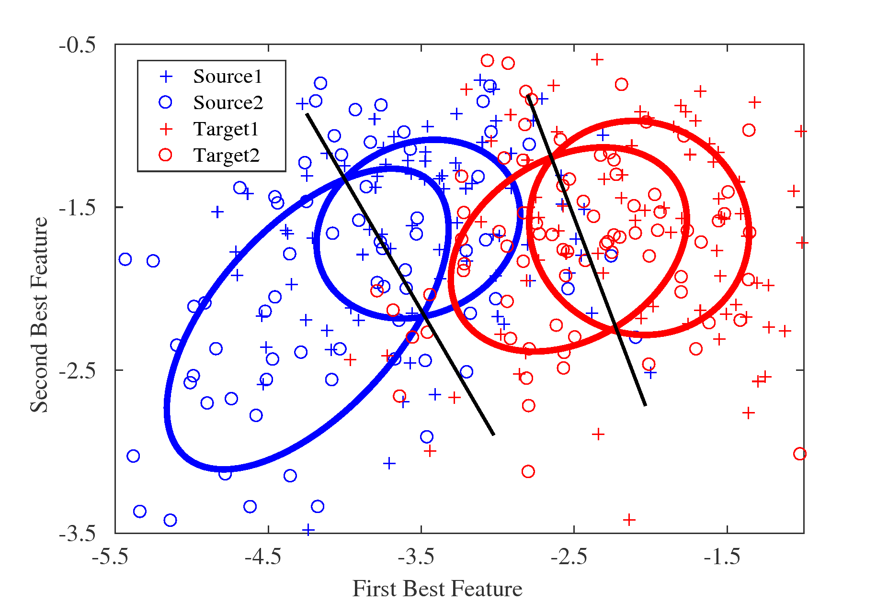

# Adaptive Selective CSP based Motor Imagery Classification for Subject to Subject Transfer

Summer research in De Sa's lab supervised by Professor Virginia De Sa. The task is to classify motor imagery cross subejct. Such task is challenging because of the lack of label in target subject. 

## ASCSP

C1, C2 are initialized as averaged normalized covariance matrices in source subject.

Then repeatedly do the following two steps.

- Find two trials in target subjetc such that the difference of the mean is minimized and variance after subspace alignment is maximized.
- Update the covariance matrix with newly selected covariance matrix. C1 = C1\*n/(n+1)+Cnew1/(n+1) and C2 = C2\*n/(n+1) + Cnew2/(n+1)

The details for selecting two trials in shown in the following algorithm.

## Effect of Subspace Alignment
###Previous ACSP

The figure above shows the Adaptive CSP proposed by Song *et al.* in paper *Improving brain–computer interface classification using adaptive common spatial patterns*

###ASCSP

The figures above is the proposed ASCSP in previous algorithm.

###ASCSP with Subspace Alignment

The figure above is ASCSP together with subspace alignment before final classification.

The domain variance is significantly reduced by selecting specific trials and then using subspace alignment.

## Result

Method    | Subj1 | Subj2 | SUbj3 | Subj4 | Subj5|Subj6
----------|-------|-------|-------|-------|------|------
CSP       |0.5055 |0.4951 |0.4969 |0.4734 |0.4704|0.5043
ACSP      |0.5062 |0.4957 |0.5179 |0.5006 |0.5019|0.5019
ASCSP     |0.5512 |0.5426 |0.5278 |0.5432 |0.5247|0.5722
ASCSP SA  |**0.5580** |**0.6401** |**0.5654** |**0.6160** |**0.5969**|**0.6562**

The table above shows the mean of subject-to-subject transfer learning in four different methods. The first row is the test subject index. The accuracies are calculated as the mean of five traiing subjects. 

The figure above illustrates the the comparison with supervised learning.

## File discriptin

- **ASCSP.m** the main file for running ASCSP with and without subspace alignment.
- **update_v1.m** the main file for updating the covariance matrix.
- **baseline.m** methods of CSP with and without subspace alignment.